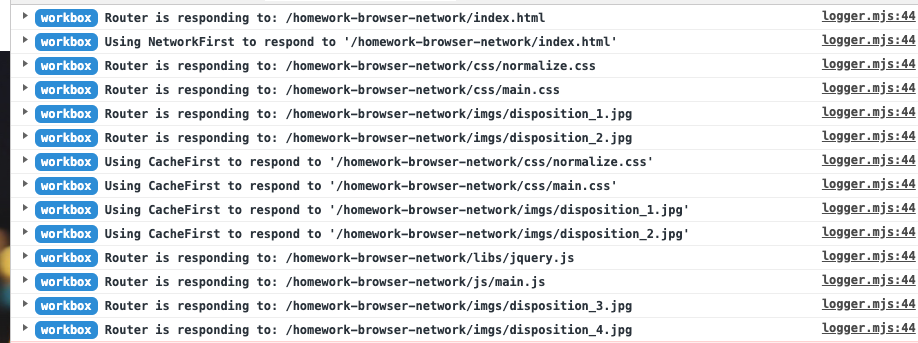

# homework-browser-network

## 运行结果截图

## HTTP 状态码规则如下：

* 1xx：指示信息--表示请求已接收，继续处理。
* 2xx：成功--表示请求已被成功接收、理解、接受。
* 3xx：重定向--要完成请求必须进行更进一步的操作。
* 4xx：客户端错误--请求有语法错误或请求无法实现。
* 5xx：服务器端错误--服务器未能实现合法的请求。

** HTTP 常见的状态码 **

* **200 OK** 请求已成功，请求所希望的响应头或数据体将随此响应返回。
* **301 Moved Permanently** 被请求的资源已永久移动到新位置，并且将来任何对此资源的引用都应该使用本响应返回的若干个URI之一。
* **302 Move Temporarily** 请求的资源临时从不同的 URI响应请求。
* **304 Not Modified** 如果客户端发送了一个带条件的 GET 请求且该请求已被允许，而文档的内容（自上次访问以来或者根据请求的条件）并没有改变，则服务器应当返回这个状态码
* **307 Temporary Redirect** 请求的资源临时从不同的URI 响应请求。新的临时性的URI 应当在响应的 Location 域中返回。
* **400 Bad Request** 1、语义有误，当前请求无法被服务器理解。2、请求参数有误。
* **401 Unauthorized** 当前请求需要用户验证。没有登录。
* **403 Forbidden** 服务器已经理解请求，但是拒绝执行它。通常是权限不够。
* **404 Not Found** 请求失败，请求所希望得到的资源未被在服务器上发现。
* **500 Internal Server Error** 服务器不支持当前请求所需要的某个功能。当服务器无法识别请求的方法，并且无法支持其对任何资源的请求。
* **502 Bad Gateway** 作为网关或者代理工作的服务器尝试执行请求时，从上游服务器接收到无效的响应。
